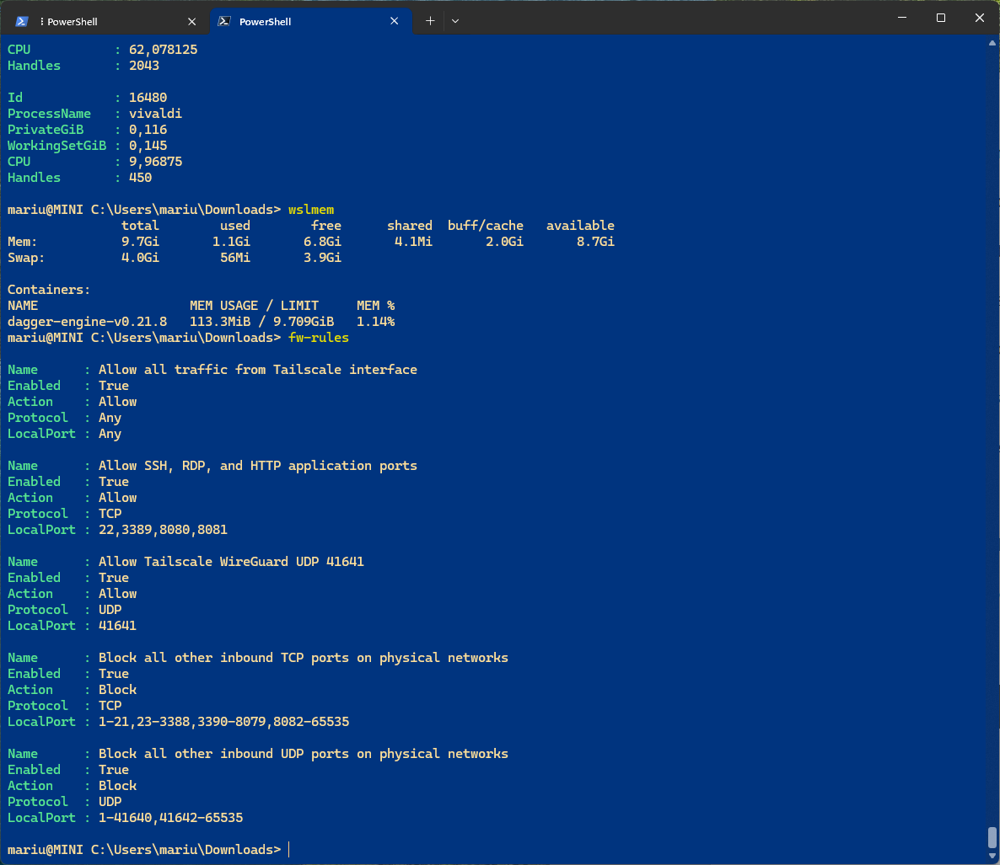
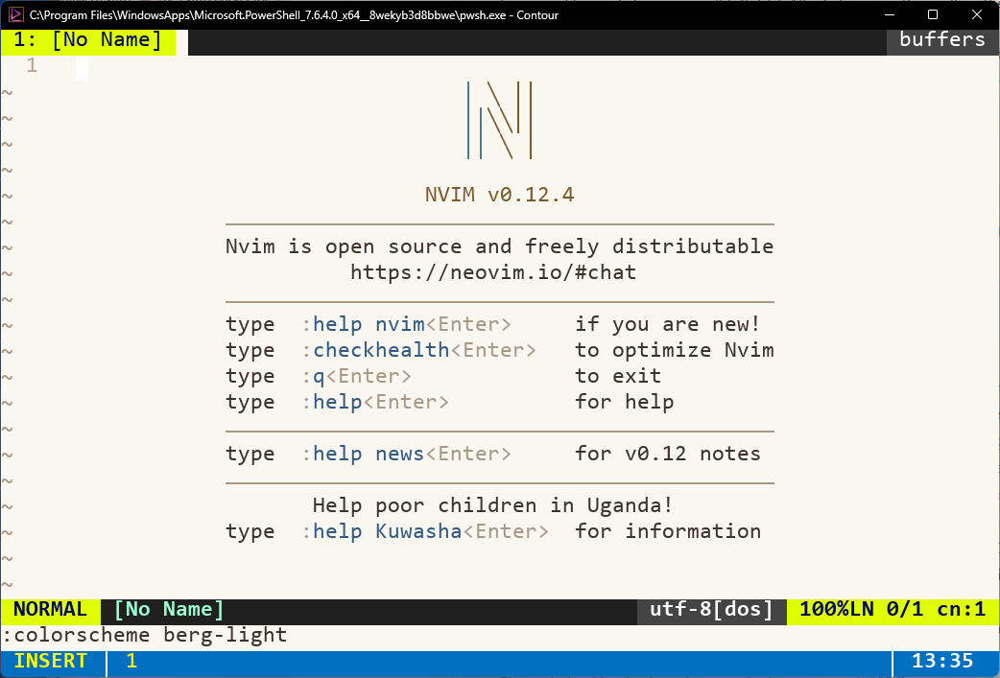

# DataWorkStation PowerShell

[](https://github.com/norandom/DataWorkStation_Powershell/actions/workflows/docs-pages.yml)
[](https://github.com/norandom/DataWorkStation_Powershell/actions/workflows/release.yml)

A managed Windows workstation for quantitative finance, data science, software development,
administration, and occasional forensic work. People and automation use the same PowerShell
commands.

Linux administrators can usually reach for a familiar utility when a system misbehaves. Windows has
equally powerful tools, but many are harder to discover and produce evidence in Windows-specific
formats. This repository gives those tools a documented PowerShell interface. A sysadmin can use it
directly or ask an AI to handle repetitive, frustrating, and time-consuming troubleshooting while
keeping every privileged action, capture, and state change visible.

## Developer documentation

**[Open the published MkDocs developer documentation →](https://norandom.github.io/DataWorkStation_Powershell/)**

Windows 11 Pro is required. This configuration uses Client Hyper-V, Windows Sandbox, native Windows
sudo, and other workstation features that are not available on every Windows edition.

The documented developer commands work in PowerShell 7 and, where noted, inbox Windows PowerShell
5.1. The test suite checks the Spec Kit EARS/TDD resource in both runtimes.

The screenshots use a GPD Pocket 4. GPD Pocket systems are popular portable machines for data-center
administrators. The hardware is an example, not a requirement. The default desired state installs
no GPD-only driver or fan controller. Generic sensor commands work when a supported provider is
present and otherwise report that no data is available.

<table>
  <tr>
    <td></td>
    <td></td>
  </tr>
  <tr>
    <td>Operational PowerShell commands for memory, containers, and managed firewall state.</td>
    <td>Contour Terminal running Neovim with the configured terminal and editor appearance.</td>
  </tr>
</table>

### Native development

The `NativeDevelopment` module installs standalone MSVC/MSBuild, CMake/Ninja, stable Rust MSVC, and
Microsoft OpenJDK 21. It does not install the Visual Studio IDE or a Unix emulation shell. You can
select `JavaToolchain` on its own when you only need `java` and `javac`. The optional Ghidra tools use
that same JDK.

```powershell
.\Apply-Workstation.ps1 -Mode Test -Module NativeDevelopment -Plan
.\Apply-Workstation.ps1 -Mode Ensure -Module NativeDevelopment
```

### Reproducible Kubernetes and infrastructure tools

The default `NixOsWsl` module provides a locked NixOS generation for Helm, kubectl, Pulumi, and native OpenSSH. It content-verifies the complete local Nix store, compares the active generation with the evaluated flake, and separately verifies the deployed `/etc/nixos` source manifest. Ordinary Debian remains the Homebrew/Docker/Dagger environment, and Debian-MW remains excluded from shared SSH state.

```powershell
.\Apply-Workstation.ps1 -Mode Test -Module NixOsWsl,SharedSshConfig -Plan
nixos-check
wsl-nix kubectl version --client
```

Read [Reproducible NixOS WSL tools](docs/nixos-wsl.md) for operation and [NixOS integrity and alteration detection](docs/nixos-integrity.md) for the exact whole-distribution hashing boundary.

## Capabilities

| Need | Commands and artifacts |
|---|---|
| Find memory owners | `mem`, `memapps`, `memproc`, `memtop`, RAMMap, PoolMon |
| Explain a crash or silent exit | event triage, scoped EVTX/ETL, WER dumps, WinDbg, optional TTD |
| Trace DNS, IPv6, firewall, and ports | socket/process maps plus PktMon ETL and PCAPNG queries |
| Render flame graphs | WPR/WPA for native/system, py-spy SVG for Python, EventPipe/Speedscope for .NET |
| Reproduce workstation state | WinGet Configuration plus focused idempotent PowerShell resources |
| Keep an investigation coherent | `tricky` cases with structured JSON and standalone HTML reports |
| Improve AI workflows safely | SkillOpt reviewed tasks, held-out gates, staged proposals, explicit adoption |
| Drive requirements into tests | release-pinned Spec Kit plus reusable EARS/TDD validation and traceability |
| Run reproducible Kubernetes tools | locked NixOS WSL generation with Helm, kubectl, Pulumi, native OpenSSH, and full-store verification |
| Triage a suspicious file | bounded host inspection, isolated document/reverse-engineering jobs, and explicitly confirmed Windows Sandbox detonation |

Start with [Getting started](docs/getting-started.md) and the [capability overview](docs/capabilities/index.md).

This repository gives PowerShell users familiar command names without installing Git Bash, MSYS, or
Cygwin. WinGet Configuration uses the DSC v3 processor for packages. Small PowerShell resources
manage Windows features, the reviewed developer hardening profile, shell profiles, Windows sudo,
btop settings, and firewall policy. The repository does not use the old DSC MOF/LCM model.

## Layout

| Path | Responsibility |
|---|---|
| `.config/configuration.winget` | Declarative WinGet package state, including `uv`. |
| `.config/git.winget` | Focused Git package state used by Scoop dependencies. |
| `.config/powershell7.winget` | Focused PowerShell 7 package state used by Contour, package, and profile dependencies. |
| `.config/go.winget` | Focused official Go MSI-backed package state for Windows development. |
| `.config/native-text-tools.winget` | Focused native Win32 package state for PowerShell `awk` and `sed`. |
| `.config/caffeine.winget` | Focused Zhorn Software Caffeine package state. |
| `.config/malware-analysis-tools.winget` | Opt-in isolated-analysis packages; excluded from the default workstation set. |
| `.terminal-fonts-sample` | Portable one-line terminal font-family example; copy it to ignored `.terminal-fonts` for local use. |
| `.wsl-env.sample` | Portable Debian, Debian-MW, and NixOS WSL distribution/user selectors; copy it to ignored `.wsl-env`. |
| `nixos/` | Locked NixOS-WSL flake, CLI package set, and read-only integrity self-check. |
| `config/nixos-wsl.psd1` | Pinned NixOS-WSL image identity, install boundary, and managed command inventory. |
| `config/shared-ssh.psd1` | Canonical Windows SSH config and trusted WSL link boundaries; Debian-MW is excluded. |
| `config/scoop.psd1` | Official per-user Scoop source and Main/Extras bucket state. |
| `config/contour-terminal.psd1` | Contour package, config, Desktop shortcut, backup, and BlueTerm source paths. |
| `config/terminal-fonts.psd1` | Pinned official Fira Code archive, per-font hashes, and per-user installation paths. |
| `config/contour.yml` | Managed Contour configuration translated from BlueTerm. |
| `config/windows-features.psd1` | Declarative Hyper-V and Windows Sandbox optional-feature state. |
| `config/workstation-modules.psd1` | Module catalog, default selection, dependencies, and execution order. |
| `config/workstation-update.psd1` | Plan-first host, package-manager, WSL, Homebrew, container, and release-reconciliation update stages. |
| `config/hardening-profiles.psd1` | Declarative Windows 11 developer hardening profile. |
| `config/debloat-profiles.psd1` | Opt-in allowlist for consumer-app and legacy-component removal. |
| `config/focus-follows-mouse.psd1` | Declarative current-user hover-focus behavior without window raising. |
| `config/developer-tools.psd1` | Pinned CodeQL and TTD versions plus Trail of Bits CodeQL packs. |
| `config/go.psd1` | Go minimum version, workspace, command path, and built-in toolchain-selection policy. |
| `config/malware-hashes.psd1` | Pinned `malware_hashes` GitHub release asset, SHA-256, and narrow install paths. |
| `config/spec-driven-development.psd1` | Pinned Spec Kit EARS/TDD release wheel, hash, and upstream CLI version. |
| `config/pester.psd1` | Pinned Pester release, shared module path, test discovery, output bounds, and parallel throttle. |
| `config/native-text-tools.psd1` | Declares the native BusyBox applet host and the two exposed PowerShell commands. |
| `config/caffeine.psd1` | Declares the real Caffeine package and installed executable names. |
| `config/malware-analysis.psd1` | Bounded host-inspection rules, indicators, supported files, and case defaults. |
| `config/malware-analysis-tools.psd1` | Pinned capa/Ghidra archives and optional WinGet analysis tools. |
| `config/linux-homebrew.psd1` | Homebrew location and prerequisites inside the managed Debian WSL distribution. |
| `config/linux-automation.psd1` | Homebrew `uv` and pinned pyinfra state for Debian-local deploys. |
| `config/developer-docker.psd1` | Adopted rootful Docker state for Dagger in developer Debian. |
| `config/rootless-podman.psd1` | Dedicated clean Debian-MW and daemonless rootless Podman state for untrusted parsers. |
| `config/malware-container.psd1` | Pinned static-container image inventory, runtime boundary, and resource limits. |
| `config/profiling-tools.psd1` | Pinned profiler versions and the feature-scoped WPT bootstrap. |
| `config/capabilities.psd1` | Machine-readable investigation and routing catalog. |
| `config/skillopt.psd1` | Pinned SkillOpt package and conservative optimization defaults. |
| `profile/Shell.ps1` | Minimal managed profile-component loader. |
| `profile/Config.ps1` | PSReadLine, prompt, and native-command precedence. |
| `profile/Tools.ps1` | Reusable diagnostics and command implementations. |
| `profile/Aliases.ps1` | Short user-facing wrappers and Linux-style mappings. |
| `scripts/Set-PowerShellProfile.ps1` | Deploys and verifies the loader and components for both PowerShell runtimes. |
| `scripts/Invoke-WorkstationUpdate.ps1` | Plans or explicitly runs the complete dependency-ordered workstation update. |
| `scripts/Invoke-WindowsUpdate.ps1` | Scans or installs accepted Windows software updates without drivers or automatic restart. |
| `scripts/Set-LinuxHomebrewState.ps1` | Maintains Homebrew inside Debian WSL as a focused developer-package prerequisite. |
| `scripts/Set-LinuxAutomationState.ps1` | Maintains the Debian-local pyinfra executor without installing it into Windows Python. |
| `scripts/Set-DeveloperDockerState.ps1` | Maintains the existing rootful Dagger Docker daemon through local pyinfra. |
| `scripts/Set-RootlessPodmanState.ps1` | Provisions Debian-MW and maintains local rootless Podman through local pyinfra. |
| `scripts/Remove-LegacyDockerMwState.ps1` | Reports retained Debian-MW Docker data and removes it only with explicit destructive confirmation. |
| `scripts/Set-DeveloperToolsState.ps1` | Maintains CodeQL, Trail of Bits packs, Semgrep CE, pyinfra-managed Dagger through Homebrew, TTD, Debian rsync, and PoolMon tags. |
| `scripts/Set-GoState.ps1` | Maintains the official Go package, `GOPATH`, command path, and `GOTOOLCHAIN=auto` behavior without overriding MSI-owned `GOROOT`. |
| `scripts/Set-MalwareHashesState.ps1` | Installs and verifies the pinned `malware_hashes` Windows release for host and Sandbox use. |
| `scripts/Set-SpecDrivenDevelopmentState.ps1` | Maintains the release-pinned EARS/TDD Spec Kit tool in an isolated `uv tool` environment. |
| `scripts/Set-PesterState.ps1` | Observes or explicitly installs the exact per-user Pester release for both PowerShell runtimes. |
| `scripts/Invoke-PowerShellTests.ps1` | Runs standard test files through one human/JSON Pester command with bounded parallel and compatibility lanes. |
| `linux/developer_tools.py` | Human-runnable pyinfra desired state for Debian developer packages. |
| `scripts/Set-ProfilingToolsState.ps1` | Maintains WPT/WPA, py-spy, dotnet-trace, and the local Speedscope viewer. |
| `scripts/Invoke-NativeCpuProfile.ps1` | Records native/system CPU traces with WPR for WPA. |
| `scripts/Invoke-PythonProfile.ps1` | Records Python sampled stacks as standalone SVG flame graphs. |
| `scripts/Invoke-DotNetProfile.ps1` | Records .NET EventPipe traces and Speedscope data. |
| `scripts/Invoke-HeadlessDumpAnalysis.ps1` | Analyzes existing dumps headlessly with cdbX64 and CLI symbol downloads. |
| `scripts/Get-ProfilerStatus.ps1` | Reports profiler availability as PowerShell objects or JSON. |
| `scripts/Invoke-Tricky.ps1` | Maintains evidence-first cases and renders Markdown, JSON, and HTML reports. |
| `scripts/Invoke-SkillOpt.ps1` | Wraps review, mock validation, provider calls, staging, and explicit adoption. |
| `scripts/Set-SkillOptState.ps1` | Installs pinned SkillOpt and maintains its safe user configuration. |
| `scripts/Set-ScoopState.ps1` | Maintains per-user Scoop and official Main/Extras buckets. |
| `scripts/Set-NativeTextToolsState.ps1` | Maintains native Win32 `awk.exe` and `sed.exe` commands without Git Bash, MSYS, or Cygwin. |
| `scripts/Set-CaffeineState.ps1` | Maintains the Caffeine package and enabled active-at-launch per-user startup. |
| `scripts/Invoke-MalwareAnalysis.ps1` | Inspects bytes on the host, plans/launches explicit Sandbox jobs, and reports existing evidence. |
| `scripts/Invoke-MalwareSandboxRunner.ps1` | Guest-only document, reverse-engineering, and bounded detonation runner. |
| `scripts/Compare-MalwareEvidence.ps1` | Validates clean-control/target case compatibility and produces retained common-tool unified diffs. |
| `scripts/Set-MalwareAnalysisToolsState.ps1` | Tests or explicitly installs the opt-in analysis toolset. |
| `scripts/Set-MalwareContainerImageState.ps1` | Tests or explicitly builds the opt-in rootless static-parser image. |
| `scripts/Invoke-MalwareContainerAnalysis.ps1` | Plans or explicitly runs non-executing Office/PDF/binary parsing. |
| `scripts/Read-MalwareEvidence.ps1` | Delegates hostile result validation and canonicalization to a bounded Python boundary. |
| `scripts/Set-ContourTerminalState.ps1` | Installs the hash-pinned official Contour MSI, deploys the BlueTerm theme, and gates success on a bounded graphics smoke test. |
| `scripts/Set-TerminalFontState.ps1` | Installs and verifies Fira Code per-user from the hash-pinned official release. |
| `scripts/Test-RepositorySkills.ps1` | Validates all repo-local skill packages locally and in CI. |
| `scripts/Invoke-PowerShellLint.ps1` | Runs the pinned PSScriptAnalyzer policy on staged paths or the full tracked tree. |
| `scripts/Install-PreCommitHook.ps1` | Installs the isolated pre-commit CLI, pinned analyzer module, and local Git hook. |
| `scripts/Set-PoolMonState.ps1` | Copies the official WinDbg/WDK pool-tag database beside PoolMon. |
| `scripts/Set-SudoState.ps1` | Maintains Windows sudo in inline (`normal`) mode. |
| `scripts/Set-WindowsFeatureState.ps1` | Tests and enables declared Windows optional features without restarting Windows. |
| `scripts/Set-HardeningState.ps1` | Plans, tests, and ensures the reviewed hardening profile without restarting Windows. |
| `scripts/Set-DebloatState.ps1` | Plans and tests opt-in removals; Ensure requires explicit confirmation and records a snapshot. |
| `scripts/Set-FocusFollowsMouseState.ps1` | Gives hovered windows focus without changing their Z-order. |
| `scripts/Set-DefenderExclusionState.ps1` | Maintains the declared Microsoft Defender path exclusions. |
| `scripts/Set-DefenderState.ps1` | Explicitly enables, disables, or reports Defender runtime protection. |
| `scripts/Set-SmartScreenState.ps1` | Controls SmartScreen Off, Medium/Warn, and Full/Block modes. |
| `scripts/Set-SaveZoneState.ps1` | Controls whether future downloads retain Mark-of-the-Web. |
| `scripts/Set-WslState.ps1` | Maintains the WSL memory and swap limits. |
| `scripts/Set-PagefileState.ps1` | Maintains a 16-32 GiB Windows pagefile policy. |
| `scripts/Set-EventLogState.ps1` | Maintains the balanced audit channels and scheduled EVTX archive task. |
| `scripts/Get-EventTriage.ps1` | Normalizes operational, crash, logon, remote, and security event views. |
| `scripts/Invoke-DevEventLogSession.ps1` | Captures scoped EVTX, ETW/WPR ETL, and WER full dumps for a development repro. |
| `scripts/Invoke-PacketCapture.ps1` | Captures NIC traffic with in-box PktMon and converts ETL to PCAPNG. |
| `scripts/Get-PcapTriage.ps1` | Provides compact packet, failure, protocol, port, and endpoint views from PktMon ETL. |
| `scripts/ssh-copy-id.ps1` | Installs an OpenSSH public key on a POSIX SSH target. |
| `scripts/Set-FirewallState.ps1` | Tests, ensures, reinitializes, removes, or restores the firewall state. |
| `.excluded.sample` | Public, machine-agnostic template for the ignored local Defender exclusion list. |
| `config/defender-exclusions.psd1` | Declares Defender performance policy and the local exclusion-list filename. |
| `config/wslconfig.ini` | Declares the global WSL 2 memory policy. |
| `config/eventlogs.psd1` | Declares channels, sizes, audit coverage, and archive rotation. |
| `config/taildrive-policy.hujson` | Tailnet policy fragment required for Taildrive. |
| `docs/Aliases.md` | Command reference and firewall behavior. |
| `.agents/skills` | Separate repo-local Codex workflows using the same commands as humans. |
| `mkdocs.yml` | Capability-focused documentation site. |
| `.github/workflows` | Strict Pages builds and version-tagged documentation releases. |
| `state/firewall-backups` | Generated full Windows Firewall backups. |

## Usage

Run from PowerShell 7:

```powershell
Copy-Item .excluded.sample .excluded
Copy-Item .wsl-env.sample .wsl-env
# Edit .excluded for this workstation.
# Set WSL_USER in .wsl-env; this workstation uses WSL_DISTRIBUTION=Debian.
.\Apply-Workstation.ps1 -Mode Test
.\Apply-Workstation.ps1 -Mode Ensure
.\Apply-Workstation.ps1 -Mode Reinitialize
```

Preview or run updates with one command:

```powershell
update
update -Json
update -Run
```

The first two commands only print a plan. `update -Run` installs accepted Windows software updates
and updates ordinary WinGet and Scoop applications. It also updates WSL, both declared Debian
distributions, the developer Homebrew installation, developer Docker, and Debian-MW rootless
Podman. The command finishes by applying and testing the current checkout's default,
non-destructive desired state.

The update command does not install drivers, restart Windows, shut down WSL, prune containers, clean
Scoop, override pinned or unknown packages, or touch undeclared distributions. See
[Managed workstation update](docs/workstation-update.md).

Use `Ensure` for routine work. It changes only resources that have drifted. Use `Reinitialize` after
troubleshooting when you need to reapply local state. That mode exports a full `.wfw` backup before
it rebuilds the managed firewall group.

Run one module and its dependencies with `-Module`:

```powershell
.\Apply-Workstation.ps1 -Mode Test -Module Firewall
.\Apply-Workstation.ps1 -Mode Ensure -Module Hardening
.\Apply-Workstation.ps1 -Mode Test -Module DeveloperTools -Plan
.\Apply-Workstation.ps1 -Mode Test -Module PowerShellTesting -Plan
.\Apply-Workstation.ps1 -Mode Test -Module Go -Plan
.\Apply-Workstation.ps1 -Mode Test -Module MalwareHashes -Plan
.\Apply-Workstation.ps1 -Mode Test -Module ContourTerminal -Plan
.\Apply-Workstation.ps1 -Mode Test -Module WindowsTerminal -Plan
.\Apply-Workstation.ps1 -Mode Test -Module MalwareAnalysisTools -Plan
```

The module DSL has three dependency stages. `Inbox` uses Windows PowerShell 5.1 and commands present
on a fresh Windows 11 Pro host. It configures Sudo and installs or tests PowerShell 7 without first
resolving `pwsh.exe`. `Core` starts after the PowerShell 7 gate passes and supplies the base packages,
profiles, tests, fonts, and terminals. `Extended` contains the remaining workstation modules.

A failed stage blocks every later selected stage. The planner also rejects a dependency that points
from an earlier stage to a later one. You can inspect the plan before PowerShell 7 is installed.

Dependencies are selected automatically. For example, Hardening requires Sudo, Scoop requires Git,
and ContourTerminal requires Sudo, PowerShell 7, and TerminalFonts. DeveloperTools brings in Go,
DeveloperDocker, LinuxAutomation, LinuxHomebrew, Packages, and PowerShell 7. MalwareAnalysisTools
requires the verified `malware_hashes` release, Windows Sandbox, WPT, and its package prerequisites.
MalwareContainerImage requires RootlessPodman.

`-Module All` means the default full run. It excludes Debloat, MalwareAnalysisTools,
MalwareContainerImage, and the destructive LegacyDockerCleanup module. See
[Sample outputs](docs/sample-outputs.md) for human and JSON output.

Defender reads managed exclusion paths from the ignored local `.excluded` file. Copy
`.excluded.sample` after cloning, then edit the copy for this workstation. You can use native Windows
`%ENVIRONMENT_VARIABLE%` references. The repository contains no workstation-specific paths and does
not remove unrelated Defender exclusions.

Defender stays active outside the excluded paths. Scheduled work runs only while the machine is idle,
uses low priority, targets 15% average CPU, and skips missed-scan catch-up jobs. The elevated
`disable-defender` and `enable-defender` commands change runtime protection but do not start a scan.
SmartScreen supports `Off`, `Medium` (`Warn` with override), and `Full` (`Block` without bypass).
SaveZone controls Mark-of-the-Web separately. This project does not change Smart App Control.

WSL is capped at 10 GiB RAM with 4 GiB swap and gradual memory reclamation. Windows uses a 16 GiB initial and 32 GiB maximum pagefile; changing that policy requires a Windows restart.

The event-log template keeps the selected live logs circular and increases their size. A scheduled
task exports the latest 48 hours to EVTX each day. It stores ZIP archives in `E:\Logs` for no more
than 14 days and caps the directory at 768 MiB. Rotation starts early when E: has less than 128 MiB
free. The task stages files under ProgramData on C:, runs from an administrator-controlled copy of
the exporter, and uses the SYSTEM account.

The package set includes PowerShell 7, Windows Terminal, Go, Microsoft Coreutils, ripgrep, rclone,
WinFsp, aria2, WinDbg, Sysinternals Suite, btop4win, uv, the .NET 10 SDK, Node.js LTS, Git, GitHub CLI
(`gh`), Tailscale, WSL, and Debian. Node.js supplies npm and npx.

Windows PowerShell 5.1 and the newest installed PowerShell Core load the same prompt, aliases, tools,
and readline settings. Windows Terminal starts PowerShell Core by default and keeps Windows
PowerShell available. Its shared Blue appearance is applied through `profiles.defaults`; unrelated
profiles, keybindings, themes, and settings are preserved.

Go comes from the official MSI-backed WinGet package. Projects choose released toolchains through
`go.mod`, `go.work`, and `GOTOOLCHAIN=auto`; the MSI continues to own `GOROOT`. Git has a separate
package declaration because Scoop depends on it. Scoop runs per-user with the official Main and
Extras buckets.

Contour Terminal comes from the exact official MSI after SHA-256 verification. The installer first
removes any legacy Scoop package. The module manages the translated BlueTerm `default` and
`blue-dark` profiles, then starts a minimized smoke test to confirm that the graphics stack works.

The Windows feature resource enables Hyper-V, Windows Sandbox, and their parent features in
dependency order. It does not restart Windows. DeveloperTools installs the verified CodeQL CLI,
public Trail of Bits query packs, Semgrep CE in an isolated uv environment, Dagger through Homebrew
in Debian WSL, standalone TTD, Debian rsync, and the official PoolMon tag database.

ProfilingTools installs only the Windows Performance Toolkit feature from the ADK. It also installs
py-spy in an isolated environment, dotnet-trace as a global .NET tool, and the local Speedscope
viewer. SkillOpt 0.2.0 uses another isolated `uv tool` environment. These tools do not use or modify
the AMD/PyTorch Python environment.

The `NativeTextTools` WinGet module supplies native `awk.exe` and `sed.exe` commands for PowerShell.
It does not install or use Git Bash, MinGit, Cygwin, MSYS, or MSYS2. BusyBox is only the native
applet host. Although its binary contains an `ash`-style shell applet, the module exposes only `awk`
and `sed`. See [Native awk and sed for PowerShell](docs/native-text-tools.md).

The Caffeine module installs Zhorn Software Caffeine through WinGet and starts it active at sign-in.
It does not use the `-startoff` flag. Run `caffeine` to start the verified 64-bit executable on demand;
use the tray icon to toggle sleep inhibition.

Start suspicious-file work with bounded host inspection:

```powershell
is-this-malware <path>
```

A target Sandbox plan runs the hash-pinned `malware_hashes` release once against the bounded host
source and once against the read-only guest copy. Clean controls skip those sample-specific runs.
Host and guest reports stay separate; only the bounded Python ingestor compares their hashes and
reports their source paths.

`disass`, `decomp`, and `malware-sandbox` write reviewable Windows Sandbox plans. They do not launch
the guest unless you add `-Run -ConfirmSandbox`. Detonation also requires `-ConfirmExecution`, and
networking stays disabled unless you enable it separately. `malware-container` follows the same
plan-first model for non-executing Office, PDF, and binary parsing in rootless Podman. Running it
requires `-Run -ConfirmContainer`; its large local image is an opt-in module.

Use `sandbox-behavior-control`, `sandbox-behavior-target`, and `sandbox-behavior-diff` for ordinary
programs. `binary-diff OLD NEW` compares Ghidra/BinExport call and control-flow graphs with BinDiff.
The SQLite sidecar supports bounded queries but does not replace graph matching with raw bytes,
version strings, or decompiler text.

`malware-control` and `malware-container-control` create matched clean controls. `malware-diff` keeps
both evidence trees and calls native Git for an ordinary no-index unified diff. PowerShell does not
deserialize raw traces or parser output. Static and dynamic cases with the same hash link to each
other, but a static indicator is not treated as proof of execution. Document analysis treats files
as inert containers and never opens them in licensed Office. See
[Suspicious-file analysis](docs/malware-analysis.md) and
[Analysis and differencing cases](docs/analysis-differencing.md).

## Automatic versus explicit actions

`Apply-Workstation.ps1 -Mode Ensure` installs or repairs the declared WinGet packages, Hyper-V,
Windows Sandbox, `DeveloperBaseline` hardening, hover focus, developer CLIs, profiling tools, and
SkillOpt configuration. Hover focus does not raise or reorder windows. Windows features and
hardening use elevated resources, but the command does not restart Windows.

The WPT resource installs only `OptionId.WindowsPerformanceToolkit`, not the full ADK. AMD uProf is
left to the operator because its installer requires interactive EULA acceptance. `uprof-install`
opens the official download page; desired state only reports whether the tool is present.

Desired state does not configure rclone credentials or create a persistent cloud mount. It does not
sign in to Semgrep, start a Semgrep or CodeQL scan, record a performance or TTD trace, attach a
debugger, capture a dump, or register a machine-wide postmortem debugger. Run those operations with
their separate shell commands.

The default run excludes the malware-analysis toolset. Analysis commands do not install missing
tools, launch Windows Sandbox, execute a sample, enable guest networking, upload content, or copy a
Microsoft 365 identity. Commands that cross those boundaries require a confirmation switch.

Debloat is opt-in. The `DeveloperMinimal` profile can inventory installed and provisioned apps plus
legacy components through its direct resource or `-Module Debloat`. Removal requires
`-ConfirmRemoval`. The profile protects package managers, runtimes, codecs, OpenSSH, Windows Hello,
WSL, Debian, and Codex.

SkillOpt does not collect Codex transcripts, contact a model provider, schedule optimization, or
adopt generated edits by default. Each operation requires reviewed task evidence and a separate
command.

The SkillOpt resource installs only the pinned stable PyPI package. It excludes the mutable source
tree, global plugin, WebUI, benchmark extras, and local-model stacks.

Git hooks live outside version control, so install them once in each clone:

```powershell
precommit-install
```

The installer adds `pre-commit==4.6.2` in an isolated uv tool environment, PSScriptAnalyzer 1.25.0,
Hadolint 2.14.0 or newer, and actionlint 1.7.12 or newer. Hadolint and actionlint come from native
WinGet packages.

PSScriptAnalyzer is the main PowerShell quality and security checker. The policy enables its built-in
Error and Warning rules except for documented conflicts with repository conventions. The remaining
hooks check staged Python, Dockerfiles, GitHub Actions, YAML (including `.winget` files), JSON, and
TOML. Documentation changes also run a strict MkDocs build. Stock pre-commit hooks reject merge
markers, case conflicts, files over the configured size limit, private keys, and mixed line endings.
They check files but do not rewrite them.

The portable parser hook IDs are `check-yaml`, `check-json`, and `check-toml`. Run one directly with
`pre-commit run check-yaml --all-files`.

Run `lint-docker`, `lint-actions`, or `lint-repository` for focused checks. Run `precommit-run` to
check the complete tracked tree.

PowerShell 7 and Windows PowerShell 5.1 use the same Pester 6.1.0 installation from the shared
per-user WindowsPowerShell module tree. `test-powershell` finds standard `*.Tests.ps1` files and runs
them in bounded file-level parallel jobs on PowerShell 7.4 or newer. `test-powershell -Compatibility`
runs the compatible suite sequentially in Windows PowerShell 5.1. Mark a test file
`#pester:no-parallel` when it needs exclusive or live system state. Tests do not install Pester; use
the `PowerShellTesting` module to inspect or repair it.

The full WDK is not installed automatically because WinDbg supplies the required `pooltag.txt`. If that source disappears, `Set-PoolMonState.ps1` reports the explicit fallback command instead of silently installing the large WDK.

Docker Engine and Compose run inside WSL, while the PowerShell module DSL manages them from Windows.
Local pyinfra applies the state inside each distribution. `Debian` keeps a rootful daemon for Dagger.
`Debian-MW` uses separate, daemonless rootless Podman for inert static parsers. The pinned
`lint-python` Ruff command checks the deploy and container code.

## Detailed documentation

- [Workstation modules and dependency order](docs/workstation-modules.md) explains focused execution.
- [Suspicious-file analysis](docs/malware-analysis.md) documents isolation, telemetry limits, and residual risk.
- [Analysis and differencing cases](docs/analysis-differencing.md) covers Sandbox behavior and graph-based binary comparison.
- [Contour Terminal and BlueTerm](docs/contour-terminal.md) covers the MSI, Scoop migration, and theme translation.
- [Windows hardening profile and attack surface](docs/hardening.md) records the legacy-script review and compatibility costs.
- [Opt-in Windows debloat profile](docs/debloat.md) lists removals, protected software, and rollback limits.
- [Commands and aliases](docs/Aliases.md) is the daily command reference.
